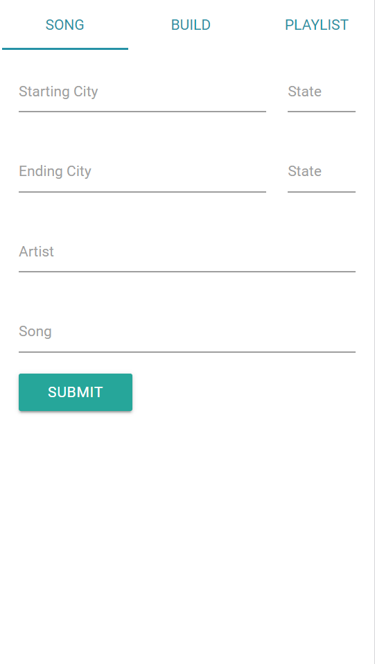
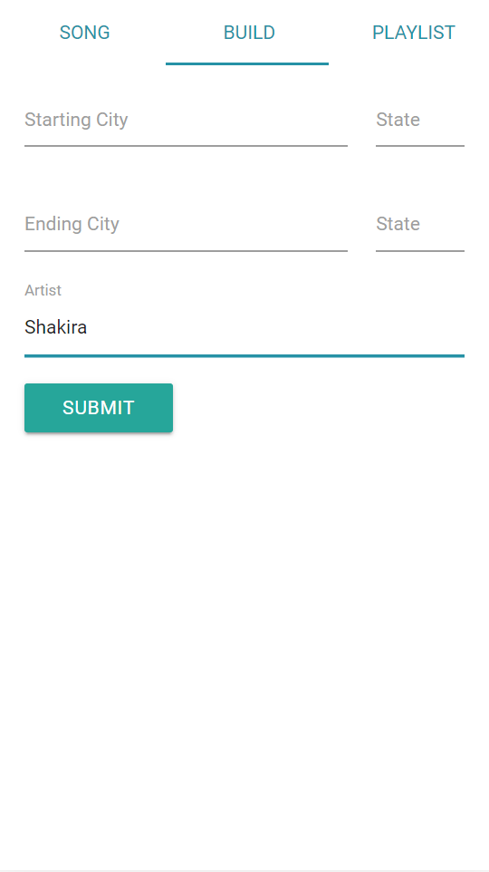
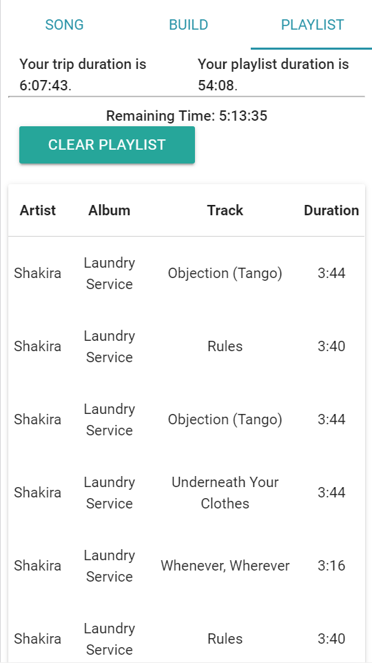

# TrackTrek

This web application was conceived by a team with the following collaborators: 
## Sean D'Amico, Eli Gorniak, Shane Nelson, Jackson Oppenheim, Brian Samuels

---

### Deployed App

You can visit the app here:
https://speedhuntersam.github.io/TeamCharmander/

---

### Description

TrackTrek is a web application created for entertainment and uses 2 APIs to get the informatios.
It has 2 basic functions:
1. The firts function is to provide the user a new "metric" for distance betweem 2 points, not using miles ou kilometers, but using music!
So, the user can see how many musics is the distance of the 2 points.

2. The second function is to create a playlist.
The user will be able to set 2 locations (like, cities) and some artist, and the app wil show a sort of albums.
The user can select all the tracks that he wants to putt in the playlist.
Then the app will can calculates the drive time, and compares it to the duration a playlist takes to play.

This is a nice application for a good trip!

---

### Technologies

-  Materialize
-  Axios
-  LocalForage
-  AudioScrobbler API
-  Mapquest API

---

### Images

#### Song Tab

---

#### Build Tab

---

#### Playlist Tab

